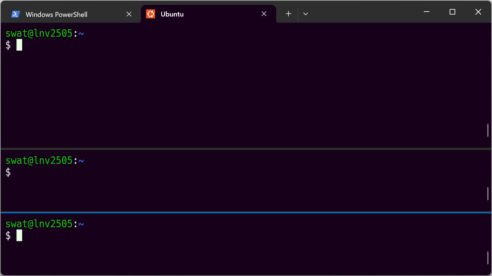
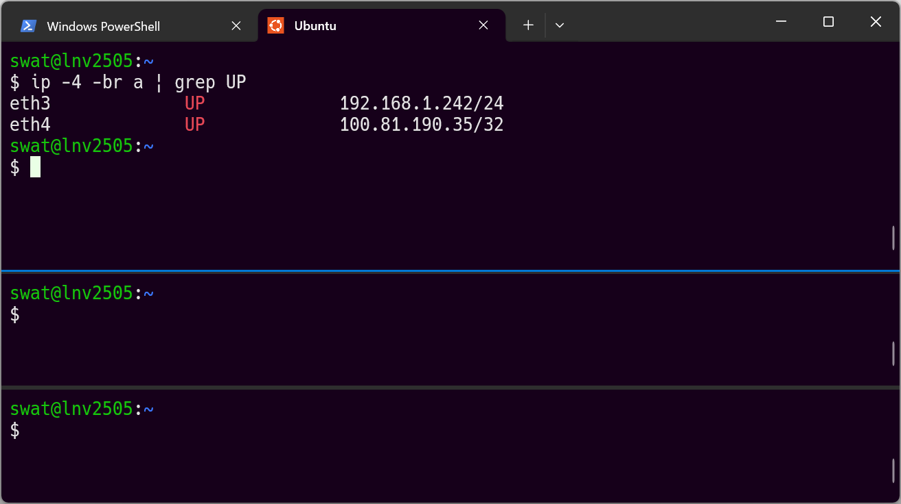
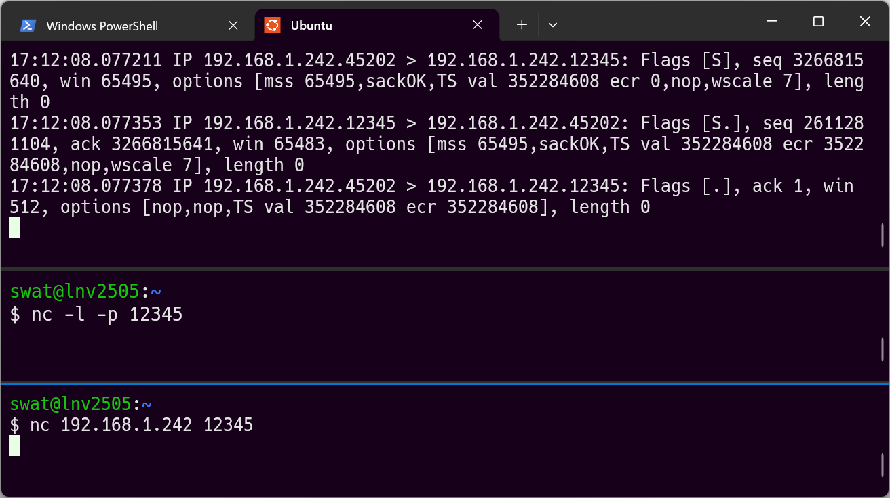
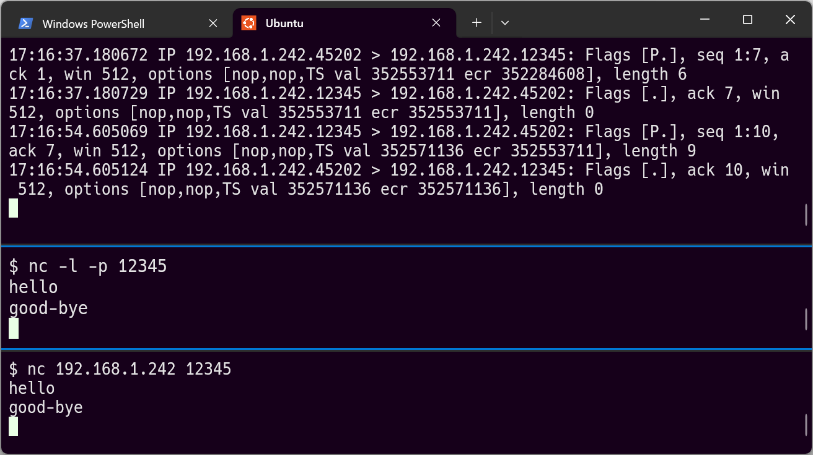

# パケットの観察（tcpdump, nc）
## 目的
この章の目的は、次の通りです。

- tcpdumpを使ったパケットの取得・閲覧ができるようになること。
- netcatの2つのモードが使えるようになること。
- TCP/IPを用いた通信手順の概要を理解すること。

## 必要な準備
PCでWSL（Windows Subsystem for Linux）が使えるようになっている必要があります。

`tcpdump`と`bind9-dnsutils`とをインストールしてください。

``` {.bash}
sudo apt update
```

- パスワードを聞かれたときには、入力してください。（以後の`sudo`でも同様。）

``` {.bash}
sudo apt install -y tcpdump  bind9-dnsutils
```

## tcpdump
### pingの観察 {.unnumbered}
自分自身（localhost）に対してpingを実施し、そのパケットを取得します。
Ubuntuのターミナルを開いてください。

tcpdumpが認識するネットワークインターフェースを確認します。

``` {.bash}
sudo tcpdump -D
```

``` {.html .resultblock}
1.eth0 [Up, Running, Connected]
2.any (Pseudo-device that captures on all interfaces) [Up, Running]
3.lo [Up, Running, Loopback]
4.bluetooth-monitor (Bluetooth Linux Monitor) [Wireless]
5.nflog (Linux netfilter log (NFLOG) interface) [none]
6.nfqueue (Linux netfilter queue (NFQUEUE) interface) [none]
7.dbus-system (D-Bus system bus) [none]
8.dbus-session (D-Bus session bus) [none]
```

自分自身へのpingパケットを取得するので、`3.lo`のパケットを取得するのが適切です。
（みなさんの環境では、番号は異なっている可能性があります。）

``` {.bash}
sudo tcpdump -n -i lo 'icmp'
```

- `-n`: 名前解決をしない。
- `-i lo`: インターフェースに`lo`を指定（番号で指定するのも可）。
- `'icmp'`: ICMPプロトコルのパケットのみ取得。

次のように、tcpdumpが待ち受けになります。

``` {.html .resultblock}
tcpdump: verbose output suppressed, use -v[v]... for full protocol decode
listening on lo, link-type EN10MB (Ethernet), snapshot length 262144 bytes
```

このウインドウはそのままにしておき、別のウィンドウでUbuntuのターミナルを開きます。
そして、自分自身にpingを実行します。

``` {.bash}
ping -c 2 127.0.0.2
```

- `-c 2` 2回実施する（指定しないとCtrl+Cで止めるまで続く）

``` {.html .resultblock}
PING 127.0.0.2 (127.0.0.2) 56(84) bytes of data.
64 bytes from 127.0.0.2: icmp_seq=1 ttl=64 time=0.236 ms
64 bytes from 127.0.0.2: icmp_seq=2 ttl=64 time=0.172 ms

--- 127.0.0.2 ping statistics ---
2 packets transmitted, 2 received, 0% packet loss, time 1021ms
rtt min/avg/max/mdev = 0.172/0.204/0.236/0.032 ms
```

::: {.callout-note}
`127.0.0.0/8`は、自分自身を意味するIPアドレス（ループバック）として
RFC 1122で予約されています。Linuxでは、`localhost`という名前が
`127.0.0.1`に割り当てられています。（`/etc/hosts`を見て確認してください。）
ここでは、`tcpdump`のrequest/replyの組が見分けやすくなるように、
よく使われる`127.0.0.1`ではなく`127.0.0.2`を用いました。
:::

もう1度pingを自分自身に実行します。今度は3回にしてみます。

``` {.bash}
ping -c 3 127.0.0.2
```

``` {.html .resultblock}
PING 127.0.0.2 (127.0.0.2) 56(84) bytes of data.
64 bytes from 127.0.0.2: icmp_seq=1 ttl=64 time=0.159 ms
64 bytes from 127.0.0.2: icmp_seq=2 ttl=64 time=0.046 ms
64 bytes from 127.0.0.2: icmp_seq=3 ttl=64 time=0.066 ms

--- 127.0.0.2 ping statistics ---
3 packets transmitted, 3 received, 0% packet loss, time 2053ms
rtt min/avg/max/mdev = 0.046/0.090/0.159/0.049 ms
```

再びtcpdumpのウインドウに戻り、`Ctrl + C`キーを押してキャプチャーを中断します。

::: {.callout-note}
`Ctrl + C`は、`Ctrl`キーを押しっぱなしにしながら`C`キーを押すことを
意味します。Windowsの「コピー」と同じ短縮キーです。
:::


``` {.html .resultblock}
$ sudo tcpdump -n -i lo 'icmp'
tcpdump: verbose output suppressed, use -v[v]... for full protocol decode
listening on lo, link-type EN10MB (Ethernet), snapshot length 262144 bytes
11:00:12.353720 IP 127.0.0.1 > 127.0.0.2: ICMP echo request, id 9601, seq 1, length 64
11:00:12.353750 IP 127.0.0.2 > 127.0.0.1: ICMP echo reply, id 9601, seq 1, length 64
11:00:13.383826 IP 127.0.0.1 > 127.0.0.2: ICMP echo request, id 9601, seq 2, length 64
11:00:13.383846 IP 127.0.0.2 > 127.0.0.1: ICMP echo reply, id 9601, seq 2, length 64
11:01:29.608296 IP 127.0.0.1 > 127.0.0.2: ICMP echo request, id 10752, seq 1, length 64
11:01:29.608312 IP 127.0.0.2 > 127.0.0.1: ICMP echo reply, id 10752, seq 1, length 64
11:01:30.631788 IP 127.0.0.1 > 127.0.0.2: ICMP echo request, id 10752, seq 2, length 64
11:01:30.631816 IP 127.0.0.2 > 127.0.0.1: ICMP echo reply, id 10752, seq 2, length 64
11:01:31.655696 IP 127.0.0.1 > 127.0.0.2: ICMP echo request, id 10752, seq 3, length 64
11:01:31.655723 IP 127.0.0.2 > 127.0.0.1: ICMP echo reply, id 10752, seq 3, length 64
^C
10 packets captured
20 packets received by filter
0 packets dropped by kernel
```

::: problem
pingの実行結果には、「56(84) bytes of data.」と書かれています。
一方で、tcpdumpの取得結果には「length 64」と書かれています。
なぜ20バイトの差が発生しているのでしょうか？
:::

::: {.callout-tip title="ヒント" collapse="true"}
[IPヘッダー](https://www.infraexpert.com/study/tcpip1.html)および
[ICMPヘッダー](https://www.infraexpert.com/study/tcpip4.html)の構造を
見比べてみましょう。
:::

::: {.callout-tip title="解答" collapse="true"}
pingとtcpdumpとでは、数えているバイト数の対象が異なります。
pingの結果に出てきた56はICMPペイロードのバイト数、84はパケット全体のバイト数です。
一方、tcpdumpの64はIPペイロードのバイト数を意味しています。
つまり差分の20バイトは、IPv4ヘッダーの部分です。
:::

### digの観察 {.unnumbered}
ICMPプロトコルに続いてUDPプロトコルを見ていきます。
最もよく使われるUDPの1つはDNSでしょう。
「[阿部寛のホームページ](http://abehiroshi.la.coocan.jp/)」の
FQDNを、`dig`コマンドを使って名前解決します。そのパケットを取得し、観察しましょう。

Ubuntuのウインドウを2枚用意します。1枚目は`tcpdump`用、2枚目は`dig`用です。

1枚目のウインドウで以下のコマンドを実行し、パケットを待ち受けます。

``` {.bash}
sudo tcpdump -n -i lo -t 'udp and (port 53)'
```

- `-n`: 名前解決をしない。
- `-i lo`: インターフェースに`lo`を指定（番号で指定するのも可）。
- `-t`: 日時を表示しない（画面を節約し、結果に集中するため）。
- `'udp and (port 53)'`: 発信元または宛先のポート番号が53番であるUDPパケットを取得。

2枚目のウインドウに切り替え、名前解決をします。

``` {.bash}
dig +short abehiroshi.la.coocan.jp
```

- `+short`: 表示を最小限にして結果だけを得る。

``` {.bash .resultblock}
222.158.205.72
```

阿部寛のホームページはIPv6にも対応しています。IPv6のアドレスも確認して
おきましょう。

``` {.bash}
dig +short AAAA abehiroshi.la.coocan.jp
```

- `AAAA`: IPv6アドレスのレコードを問い合わせる。

``` {.bash .resultblock}
2001:258:8613:5000::101
```

また失敗例として、存在しないドメイン名も問い合わせておきます。

``` {.bash}
dig +short example.jp
```

1枚目のウインドウに戻って、`Ctrl+C`キーを押してパケット取得を停止し、
結果を確認します。（一部の数字は実行時ごとに異なります。）

``` {.html .resultblock}
$ sudo tcpdump -n -i lo -t 'udp and (port 53)'
[sudo] password for swat:
tcpdump: verbose output suppressed, use -v[v]... for full protocol decode
listening on lo, link-type EN10MB (Ethernet), snapshot length 262144 bytes
IP 10.255.255.254.46573 > 10.255.255.254.53: 58814+ [1au] A? abehiroshi.la.coocan.jp. (64)
IP 10.255.255.254.53 > 10.255.255.254.46573: 58814 1/0/1 A 222.158.205.72 (68)
IP 10.255.255.254.47038 > 10.255.255.254.53: 36348+ [1au] AAAA? abehiroshi.la.coocan.jp. (64)
IP 10.255.255.254.53 > 10.255.255.254.47038: 36348 1/0/1 AAAA 2001:258:8613:5000::101 (80)
IP 10.255.255.254.47662 > 10.255.255.254.53: 58328+ [1au] A? example.jp. (51)
IP 10.255.255.254.53 > 10.255.255.254.47662: 58328 NXDomain 0/1/1 (86)
```

`tcpdump`は、DNSプロトコルを解釈した結果を表示しています。以下に簡単に解説しますが、
詳しくは[DNSに関する書籍](https://www.sbcr.jp/product/4815622657/)で学習してください。

1行目は、UDP 53番ポート（53/udp）宛てなので、DNS問い合わせのパケットです。
`10.255.255.254`というIPアドレスはWSLに特有のものです。
このIPアドレスが、ホストOSとの仲介役になって名前解決を行っています。

`58814+`の`58814`は問い合わせIDを意味します。また、`+`は、再帰可能フラグがセットされている
ことを意味します。言い方を変えると、クライアントがサーバーに対して名前解決を完全に
行ってほしいと伝えているのです。

`[1au]`は、追加フィールドが1つ存在することを意味します。ほとんどの場合、EDNS0という
拡張プロトコルです。DNSはもともと512バイトを超えるメッセージがそのままでは扱えなかった
（TCPにフォールバックしていた）ところ、IPv6やDNSSECの登場に伴って長いメッセージを
取り扱う必要性が増したことからEDNS0が定められました。

`A? abehiroshi.la.coocan.jp.`は、`abehiroshi.la.coocan.jp`の`A`レコードを問い合わせて
いることを意味しています。

2行目は、53/udpからのパケットなので、DNSサーバーからの応答です。
`1/0/1`は、それぞれ「Answer / Authority / Additional」の数を意味しています。
レコードが1つ返ってきたので1、それは権威情報を含んでいないので0、
EDNS0の応答で1となっています。

3行目と4行目とは、1行目・2行目のIPv6版です。
5行目と6行目とは、存在しないドメインへの名前解決をしようとしたときの例です。

::: problem
`www.jcom.co.jp`をdigしたときの結果は、次の通りでした。

``` {.bash .resultblock}
www.jcom.co.jp.cdn.cloudflare.net.
104.16.174.236
104.16.175.236
```

tcpdumpでパケットを取得したとき、「Answer / Authority / Additional」の組は
どのようになると思いますか？　想像し、その後検証してください。
:::

::: {.callout-tip title="解答" collapse="true"}
次のように、「3/0/1」となります。

``` {.html .resultblock}
IP 10.255.255.254.48428 > 10.255.255.254.53: 13980+ [1au] A? www.jcom.co.jp. (55)
IP 10.255.255.254.53 > 10.255.255.254.48428: 13980 3/0/1 CNAME www.jcom.co.jp.cdn.cloudflare.net., A 104.16.175.236, A 104.16.174.236 (122)
```
:::

### curlの観察 {.unnumbered}
続いて、TCPプロトコルとしてHTTPを取り上げます。

Ubuntuのウインドウを2枚用意します。1枚目は`tcpdump`用、2枚目は`curl`用です。

1枚目のウインドウで以下のコマンドを実行し、パケットを待ち受けます。
これまではファイルを画面上に表示していましたが、今回は`curl.pcap`という
名前でファイル出力することにします。

``` {.bash}
sudo tcpdump -i any -w curl.pcap 'port 80'
```

- `-i any`: 全インターフェースを対象（本来は特定の1つを指定すれば十分）。
- `-w curl.pcap`: `curl.pcap`というファイル名で出力。
- `'port 80'`: 発信元または宛先のポート番号が80番であるパケットを取得。

2枚目のウインドウに切り替え、阿部寛のホームページを閲覧します。

``` {.bash}
curl --ipv4 http://abehiroshi.la.coocan.jp/
```

- `--ipv4`: IPv4だけを使用する（出力結果をそろえるために指定）。

1枚目のウインドウに戻り、`Ctrl+C`キーを押してパケット取得を停止させます。

``` {.html .resultblock}
^C12 packets captured
12 packets received by filter
0 packets dropped by kernel
```

そのまま、ファイルが存在するかどうかを確認します。

``` {.bash}
ls -l curl.pcap
```

``` {.html .resultblock}
-rw-r--r-- 1 tcpdump tcpdump 1957 Dec 30 13:11 curl.pcap
```

::: {.callout-important}
もし`ls`の結果が

``` {.html .resultblock}
ls: cannot access 'curl.pcap': No such file or directory
```

であれば、のように表示されたら、パケットの取得に失敗しています。
本節「curlの観察」の最初からやり直してください。
:::

`tcpdump`の`-r`オプションを用いて、いま取得したパケットを読みます。
環境によってIPアドレスやインターフェース名は変化しますので、完全に
同一の結果にはなりません。

``` {.bash}
tcpdump -n -t -r curl.pcap
```

- `-n`: 名前解決をしない。
- `-t`: 日時を表示しない（画面を節約し、結果に集中するため）。
- `-r curl.pcap'`: `curl.pcap`を読み込む。

```{html}
#| eval: false
#| code-line-numbers: true

reading from file curl.pcap, link-type LINUX_SLL2 (Linux cooked v2), snapshot length 262144
Warning: interface names might be incorrect
eth3  Out IP 192.168.1.242.45376 > 222.158.205.72.80: Flags [S], seq 116484521, win 64440, options [mss 1432,sackOK,TS val 3242019354 ecr 0,nop,wscale 7], length 0
eth3  In  IP 222.158.205.72.80 > 192.168.1.242.45376: Flags [S.], seq 1680624244, ack 116484522, win 14120, options [mss 1412,nop,wscale 0,sackOK,TS val 1836076075 ecr 3242019354], length 0
eth3  Out IP 192.168.1.242.45376 > 222.158.205.72.80: Flags [.], ack 1, win 504, options [nop,nop,TS val 3242019365 ecr 1836076075], length 0
eth3  Out IP 192.168.1.242.45376 > 222.158.205.72.80: Flags [P.], seq 1:87, ack 1, win 504, options [nop,nop,TS val 3242019365 ecr 1836076075], length 86: HTTP: GET / HTTP/1.1
eth3  In  IP 222.158.205.72.80 > 192.168.1.242.45376: Flags [.], ack 87, win 14206, options [nop,nop,TS val 1836076086 ecr 3242019365], length 0
eth3  In  IP 222.158.205.72.80 > 192.168.1.242.45376: Flags [P.], seq 1:776, ack 87, win 14206, options [nop,nop,TS val 1836076090 ecr 3242019365], length 775: HTTP: HTTP/1.1 200 OK
eth3  Out IP 192.168.1.242.45376 > 222.158.205.72.80: Flags [.], ack 776, win 510, options [nop,nop,TS val 3242019380 ecr 1836076090], length 0
eth3  Out IP 192.168.1.242.45376 > 222.158.205.72.80: Flags [F.], seq 87, ack 776, win 510, options [nop,nop,TS val 3242019381 ecr 1836076090], length 0
eth3  In  IP 222.158.205.72.80 > 192.168.1.242.45376: Flags [.], ack 88, win 14206, options [nop,nop,TS val 1836076101 ecr 3242019381], length 0
eth3  In  IP 222.158.205.72.80 > 192.168.1.242.45376: Flags [F.], seq 776, ack 88, win 14206, options [nop,nop,TS val 1836076101 ecr 3242019381], length 0
eth3  In  IP 222.158.205.72.80 > 192.168.1.242.45376: Flags [F.], seq 776, ack 88, win 14206, options [nop,nop,TS val 1836077101 ecr 3242019381], length 0
eth3  Out IP 192.168.1.242.45376 > 222.158.205.72.80: Flags [.], ack 777, win 510, options [nop,nop,TS val 3242020392 ecr 1836077101], length 0
```

3行目から5行目において、TCPの3ウェイハンドシェイクを確立させています。
Flagsフィールドが[S]->[S.]->[.]となっています。tcpdumpでは、ACKが
`.`で表されます。

## netcat
netcatは、Unixのネットワークソケットにバイナリ列を渡すだけのツールです。
TCP/IP通信の観察がやりやすいですし、トラブルシューティングにも使えます。

今回は、netcatのプロセスを2つ使って自分自身に対する通信を行い、そのようすを
tcpdumpで観察します。

その前に、2点準備をします。

### WSLで画面分割を行う  {.unnumbered}
リアルタイムで状況を観測したいのに、タブを切り替えるのは面倒です。
WSLには、[1つのタブの中で画面分割する機能](https://learn.microsoft.com/ja-jp/windows/terminal/panes)が備わっています。
分割された1つ1つの枠をペイン（pane）と呼びます。

左右（垂直軸）に分割する短縮キーは`Alt + Shift + +`、
上下（水平軸）に分割する短縮キーは`Alt + Shift + -`です。

`Alt + Shift + -`を2回実行して、上下に画面を3分割してください。

{fig-align="center" width=80%}

1番のペインから、tcpdump、nc（サーバーモード）、
nc（クライアントモード）に利用します。

### 自分のIPアドレスを確認する {.unnumbered}
以下のコマンドを使って、自分自身のIPアドレスを確認してください。

``` {.bash}
ip -4 -br a | grep UP
```

- `-4`: IPv4アドレスのみ表示する
- `-br`: 簡潔に表示する
- `a`: IPアドレスを表示する（`addr`の略）
- `| grep UP`: リンクアップしているものだけを抽出

{fig-align="center" width=80%}

上記は私の自宅のPCでコマンドを実行した場合の例です。
VPN接続を行っているときには、複数のIPアドレスが表示されます。
どのIPアドレスを使っても構いません。私はeth3のIPアドレスを
使うことにします。

### tcpdump {.unnumbered}
1番目のペインで次のコマンドを実行し、パケットを取得する準備に入ります。

``` {.bash}
sudo tcpdump -n -i lo 'port 12345'
```

### サーバーモード {.unnumbered}
2番目のペインで次のコマンドを実行し、netcatでTCP/IP接続を待ち受けます。

``` {.bash}
nc -l -p 12345
```

### クライアントモード {.unnumbered}
3番目のペインで次のコマンドを実行し、先に確認したIPアドレスに接続します。

``` {.bash}
nc -l IPアドレス 12345
```

IPアドレスが正しければ、1番目のペインで3ウェイハンドシェイクの確立が見られます。

{fig-align="center" width=80%}

::: problem
2つのnetcatで通信が確立した状態で、それぞれのペインで文字（半角英数）を入力し、
先方に伝わることを確かめてください。

このとき、tcpdumpのseqやackの値の推移に着目し、その意味を考えましょう。
:::

::: {.callout-tip title="解答" collapse="true"}
{fig-align="center" width=80%}

上の画面は、クライアント側（最も下のペイン）で`hello`と入力し、
そのあとサーバー側（真ん中のペイン）で`good-bye`と入力したときの状態です。

tcpdumpの結果の1行目（17:16:37.180672）は、`seq 1:7`、`length 6`とあります。
`length 6`なのは、`hello`の5バイトに改行文字（`0x0a`）が付与されているためです。
そして`seq 1:7`は、1番目から6バイト送信し、先方からのACKの値が7になることを
期待しているという意味です。

そして2行目を見ると、たしかに`ack 7`となっているので、パケットが正常に到達
していることがわかります。

ただし、tcpdumpが表示するシーケンス番号は相対値です。
絶対値で見たいときには`-S`オプションをつけてください。
:::

## 追加課題
GitHubから入手できるpcapファイルを調査します。以下のコマンドを使って、
ファイルをダウンロードしてください。

``` {.bash}
wget https://raw.githubusercontent.com/markofu/pcaps/refs/heads/master/PracticalPacketAnalysis/ppa-capture-files/ftp.pcap
```

::: problem
先頭のパケットが取得された日時（YYYY-MM-DD HH:NN:SS）をUTCで回答してください。
:::

::: {.callout-tip title="ヒント" collapse="true"}
`-tttt`オプションを使うと、人間が読める形式になります。
:::

::: {.callout-tip title="解答" collapse="true"}
``` {.bash}
TZ=UTC tcpdump -n -tttt -r ftp.pcap -c 1
```
2006-12-16 17:24:40。tcpdumpはローカル時間で表示します。
UTCで表示するには、最初に`TZ=UTC`を付加しておきます。
:::

::: problem
このファイルに登場するIPv4アドレスを、すべて列挙してください。
:::

::: {.callout-tip title="ヒント" collapse="true"}
`cut`コマンドを駆使して、必要なフィールドだけを切り抜きます。

たとえば
``` {.bash}
2006-12-16 17:24:43.167931 IP 192.168.0.193.7254 > 192.168.0.114.1140: 
```

から「`192.168.0.193`」の部分を抽出したければ、

``` {.bash}
cut -d ' ' -f 4 | cut -d '.' -f 1-4
```

です。

- `-d`: 区切り文字を指定。
- `-f`: フィールド番号を指定。
:::

::: {.callout-tip title="ヒント" collapse="true"}
`sort`や`uniq`コマンドによって重複を排除します。
:::

::: {.callout-tip title="解答" collapse="true"}
``` {.bash}
tcpdump -n -tttt -r ftp.pcap | cut -d ' ' -f 4 | cut -d '.' -f 1-4 | sort | uniq
```

を実行すると、送信元IPアドレスは

``` {.bash}
192.168.0.114
192.168.0.193
63.245.209.21
```

の3つであることが分かります。宛先でも同様にすると

``` {.bash}
tcpdump -n -tttt -r ftp.pcap | cut -d ' ' -f 6 | cut -d '.' -f 1-4 | sort | uniq
```

同じ結果を得るので、上記の3つのIPアドレスがすべてです。
:::

::: problem
FTPサーバーと思われるIPアドレスは何でしょうか？
:::

::: {.callout-tip title="ヒント" collapse="true"}
FTPサーバーは、通常`21/tcp`で接続を待ち受けます。
:::

::: {.callout-tip title="解答" collapse="true"}
``` {.bash}
tcpdump -n -tttt -r ftp.pcap 'dst port 21' -c 1
```

すると、`192.168.0.193`が21番ポートで接続を受け付けていることが分かります。
よって、FTPサーバーは`192.168.0.193`です。
:::

::: problem
FTPサーバーのユーザー名とパスワードは何ですか？
:::

::: {.callout-tip title="ヒント" collapse="true"}
FTPサーバーの通信は暗号化されていません。
:::

::: {.callout-tip title="解答" collapse="true"}
``` {.bash}
tcpdump -n -tttt -r ftp.pcap 'dst port 21' -c 1
```

3本目に`USER`が、4本目に`PASS`が見えます。それぞれ、`csanders`と
`echo`です。
:::

## 参考資料
- Charles M. Kozierok「[The TCP/IP Guide](http://www.tcpipguide.com/)」
- ネットワークエンジニアとして「[TCP/IP](https://www.infraexpert.com/study/tcpip.html)」
- SEの道標「[ICMPとは](https://milestone-of-se.nesuke.com/nw-basic/ip/icmp/)」
- SEの道標「[初心者にも分かるTCP/UDP](https://milestone-of-se.nesuke.com/nw-basic/tcp-udp/tcp-udp-summary/)」
- SEの道標「[TCPコネクションのシーケンスと状態確認](https://milestone-of-se.nesuke.com/nw-basic/tcp-udp/tcp-connection/)」
- The Tcpdump Group「[TCPDUMP and LIBPCAP](https://www.tcpdump.org/)」
- 杜甫々「[とほほのtcpdump入門](https://www.tohoho-web.com/ex/tcpdump.html)」
- 大角祐介「[ネットワーク診断の現場から（netcat編・その1）](https://www.intellilink.co.jp/column/security/2015/070100.aspx)」
- 大角祐介「[ネットワーク診断の現場から（netcat編・その2）](https://www.intellilink.co.jp/column/security/2016/041300.aspx)」
- NETERSEC「[Publicly available PCAP files](https://www.netresec.com/?page=PcapFiles)」