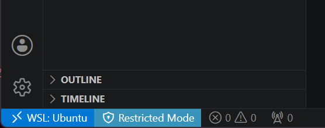

# Quartoスライド作成環境を作る
## 目的
この章は番外編です。この資料もスライドも、
すべて[Quarto](https://quarto.org/)で作られています。

QuartoはPandocベースのオープンソース科学・技術出版システムで、
原稿をMarkdown（`.qmd`）記法で記載し、それをコンパイルすることで
文書ファイルを作成します。

1つの文書の中で文書とコードと実行結果とが同居できる点が最大の
魅力ですが、スライド作成がPowerPointなしで済ませられる点も強力です。
Gitによる版管理、厳密な位置合わせ、自動化が達成できるからです。
また、Agentic AIとの相性もよく、草稿や目次案の生成もできます。

この章では、WSLが入ったWindows 11環境を念頭において、
Visual Studio CodeでQuartoによるスライド作成を実現するための
方法を紹介します。

::: {.callout-note}
私自身は[自作のDocker Composeファイル](https://github.com/dfirr/rocker-dfir)を
使い、RStudio Serverで執筆しています。データ分析がメインであれば、非常に有用です。
:::

## 必要な準備
以下の2点を前提とします。

- WSL（Windows Subsystem for Linux）が使えるようになっていること。
- Visual Studio Codeが使え、`code`コマンドで起動できること。

以下は、WSL上で実行します。

### Quartoのインストール
日本語フォントをインストールします。
GoogleとAdobeとで共同開発されたNotoがあれば、最低限にはなります。

```{.bash .bashblock}
sudo apt update;
```

```{.bash .bashblock}
sudo apt install -y fonts-noto-cjk
```

Quartoは`.deb`ファイルで提供されています。
執筆時点では`1.10.18-linux-amd64.deb`が最新版ですが、必要に応じて
新しいものをダウンロード、インストールしてください。

```{.bash .bashblock}
cd /tmp
```

```{.bash .bashblock}
curl -LO https://github.com/quarto-dev/quarto-cli/releases/download/v1.10.18/quarto-1.10.18-linux-amd64.deb
```

```{.bash .bashblock}
sudo apt install -y ./quarto-1.10.18-linux-amd64.deb
```

インストールの状況を確認するために、`quarto check`コマンドを実行します。

```{.bash .bashblock}
quarto check
```

```{.bash .bashblock}
$ quarto check
Quarto 1.10.18
[✓] Checking environment information...
      Quarto cache location: /home/swat/.cache/quarto
[✓] Checking versions of quarto binary dependencies...
      Pandoc version 3.10.0: OK
      Dart Sass version 1.101.0: OK
      Deno version 2.7.14: OK
      Typst version 0.15.1: OK
[✓] Checking versions of quarto dependencies......OK
[✓] Checking Quarto installation......OK
      Version: 1.10.18
      Path: /opt/quarto/bin

[✓] Checking tools....................OK
      TinyTeX: (not installed)
      Chrome Headless Shell: (not installed)
      VeraPDF: (not installed)

[✓] Checking LaTeX....................OK
      Tex:  (not detected)

[✓] Checking Chrome Headless....................OK
      Chrome:  (not detected)

[✓] Checking basic markdown render....OK

[✓] Checking R installation...........(None)

      Unable to locate an installed version of R.
      Install R from https://cloud.r-project.org/

[✓] Checking Python 3 installation....OK
      Version: 3.12.3
      Path: /usr/bin/python3
      Jupyter: (None)

      Jupyter is not available in this Python installation.
      Install with python3 -m pip install jupyter

[✓] Checking Julia installation...
```

上のように、Quartoから利用可能な環境の存在がチェックされます。

::: {.callout-note}
インタラクティブなプログラミング環境が必要であれば、Jupyterを入れてください。
少なくとも以下の3つがあれば、`quarto check`は成功します。

```{.bash .bashblock}
sudo apt install -y python3-ipykernel python3-nbformat python3-nbclient
```
:::

### VS Code機能拡張のインストール
最低限必要な機能拡張は、次の2つです。CLIでインストールするには、
PowerShellで次のようにします。（本当はWSLでもかまいません。）

```{.powershell .psblock}
code --install-extension ms-vscode-remote.remote-wsl
```

```{.powershell .psblock .resultblock}
code --install-extension quarto.quarto
```

次のようにして、インストール状況を確認できます。

```{.powershell .psblock}
code --list-extensions | Select-String 'remote-wsl|quarto'
```

```{.powershell .psblock}
> code --list-extensions | Select-String 'remote-wsl|quarto'
ms-vscode-remote.remote-wsl
quarto.quarto
```

## 最初のスライド
### スライド作成
では、Quartoでスライドを作ってみましょう。WSLにて、作業用ディレクトリを
作り、そこに移動します。

```{.bash .bashblock}
mkdir -p ~/quarto-first
```

```{.bash .bashblock}
cd ~/quarto-first
```

そして、そのディレクトリでVSCodeを実行します。

```{.bash .bashblock}
code .
```

すると、Windows側にてVSCodeのウインドウが表示されます。

ウインドウの左側で、2点確認すべき点があります。

第1に、左下の青い部分が「WSL: Ubuntu」となっている必要があります。
さもなくば、WSL Remote機能拡張が正しく認識されていません。

第2に、左下の水色の部分が「Restricted Mode」になっていて、その
ディレクトリが信頼されていない状態にあるのを、修正する必要があります。
それには、「Restricted Mode」のアイコンをクリックし、「Trust」ボタンを
押してください。水色の部分が消えれば成功です。

{fig-align=center}

最初に作るスライドは、`slide.qmd`という名前にします。WSLの
ターミナルで、以下のコマンドを実行します。

```{.bash .bashblock}
code slide.qmd
```

すると、VSCodeのウインドウ内に、`slide.qmd`のタブが表示されます。
そこに、以下のテキストを貼り付けます。

~~~~markdown
---
title: Quarto + Reveal.js入門
author: テスト太郎
format:
  revealjs:
    theme: simple
    slide-number: true
    embed-resources: true
    transition: fade
---

## Quartoとは

Markdownから、HTML、PDF、Word、Webサイト、スライドを生成できるツールです。

## なぜプレゼンに使うのか

- テキストで管理できる
- Gitで差分が見える
- 再利用しやすい
- 図表やコードを埋め込みやすい

## Quartoのしくみ

これは「Markdownを入力にして、HTMLを出力するビルドツール」です。

```{.bash}
quarto render slides.qmd
```

## おしまい

ありがとうございました。
~~~~

### プレビューと結果取得


## テーマを変える


## おわりに


## 参考文献
